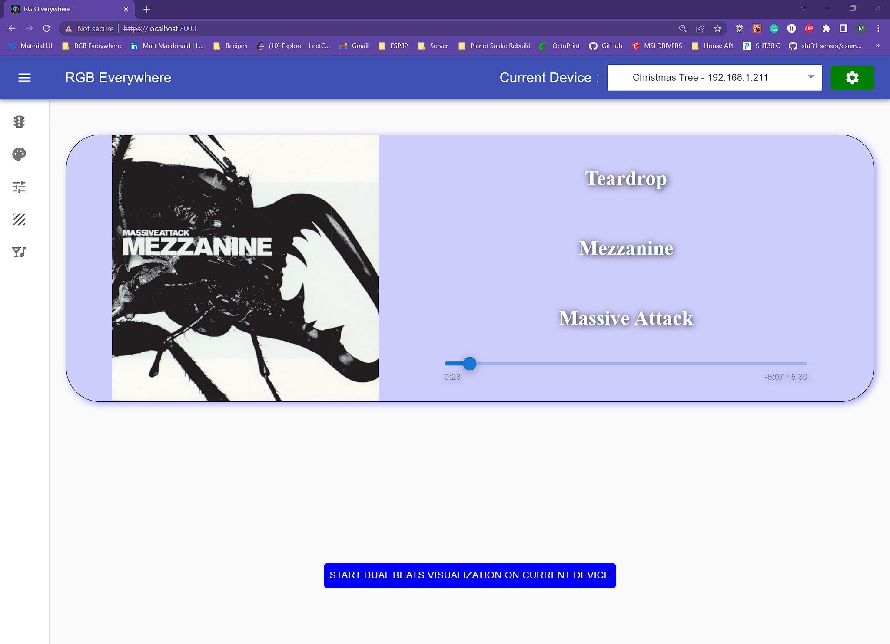
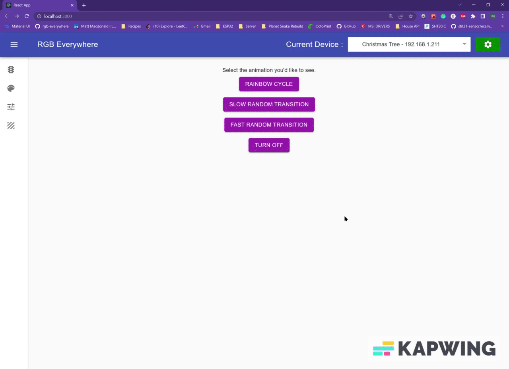
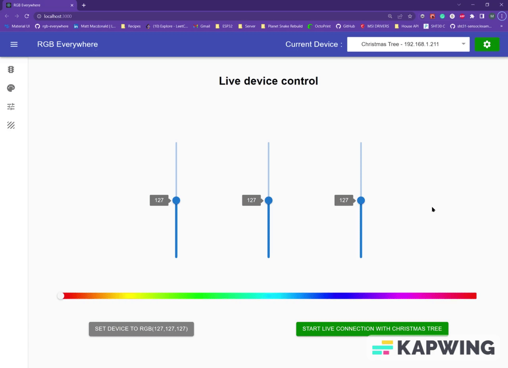
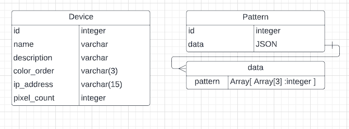

# RGB Everywhere - Web Interface

RGB Everywhere has spawned from <a href="https://github.com/sagacious-solutions/react-christmas-tree">React christmas tree </a> which started as a way to control my christmas tree lights. Now it has grown to support multiple display devices at a time. Adding new devices is easy and the more you add, the sooner you'll have RGB Everywhere!

See repo <a href="https://github.com/sagacious-solutions/rgb-everywhere-hardware-api">rgb-everywhere-hardware-api</a> for lighting device code. 
See repo <a href="https://github.com/sagacious-solutions/rgb-everywhere-db">rgb-everywhere-db</a> for database.

Bunny for scale.

# Tech-Stack
 - JavaScript ES6
 - HTML
 - CSS
 - React JS
 - Socket.io
 - Dotenv
 - Material UI
 - React-Color
 - spotify-web-api-js 
 - Python
 - Flask
 - SQLAlchemy
 - Windows Subsystem for Linux
 - Debian Linux
 - WS281x Lighting Strips
 - Raspberry Pi 4
 - 2 Raspberry Pi Zero 2's
 - Ender 3 Pro V2 for Printing Screen Mount
 - Fusion 360 for Parts Design

# Demo of Visualizer

# Easily manage available display devices

    

# Live connection via Websockets
The live device control page allows for live control of any device with a socket connection. Once connected you will see the any color changes appear on the device instantly.

    

 
 

# Create your own light string patterns
On this page you can create your own light string patterns. By hitting preview color, you can see what it looks like on the tree before commiting to it. Once you hit "Set Device to Pattern" it will repeat that pattern across the string of lights.

The edit button allows you to edit an existing saved pattern. Once edited you can hit the replace icon and it will update the pattern in the database. There's also a save button at the bottom to create new patterns as well as a delete button in the table to get rid of patterns your bored of.

 

    

 
 

# Controller

Although the tree can be controlled from any local web browser, the project features its own touch screen. This 7 inch touchscreen is powered by a Raspberry Pi 4 and features a 3D printed PLA holder. Using PM2, the React Server is daemonized here for easy updates over SHH from the main dev machine.
 
 
 
 

# Database ERD

# Setup

1 ) Clone Repo

2 ) Run 'yarn' to install dependencies

3 ) run 'yarn start' to start server in development mode.

My preference for running servers is to Daemonize them with <a href="https://pm2.keymetrics.io/">pm2</a> to have them start on boot and also keep them open after disconnecting from SSH.

## To Use PM2

1) npm install pm2 -g
2) pm2 startup
3) pm2 start "yarn start" --name "xmas-tree"
4) pm2 save

