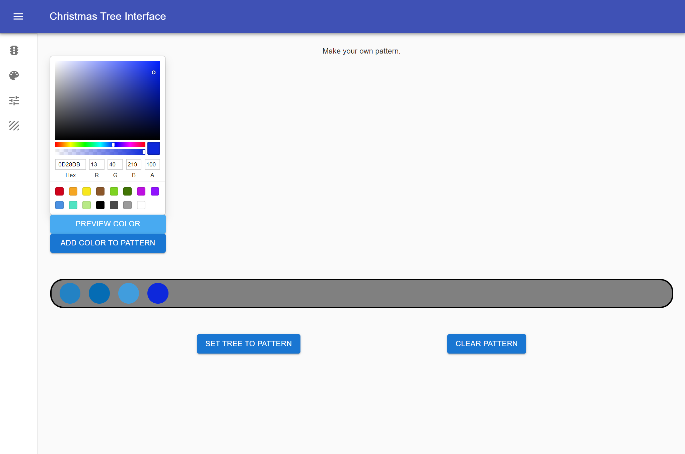

# RGB Everywhere - Web Interface

RGB Everywhere has spawned from <a href="https://github.com/sagacious-solutions/react-christmas-tree">React christmas tree </a> which started as a way to control my christmas tree lights. Now it has grown to support multiple display devices at a time. Adding new devices is easy and the more you add, the sooner you'll have RGB Everywhere!

See repo <a href="https://github.com/sagacious-solutions/raspberry-xmas-tree">raspberry-xmas-tree</a> for hardware API.
See repo <a href="https://github.com/sagacious-solutions/rgb-everywhere-db">rgb-everywhere-db</a> for database.

Bunny for scale.

# Tech-Stack
 - JavaScript ES6
 - HTML
 - CSS
 - React JS
 - Socket.io
 - Material UI
 - SQLAlchemy
 - Flask
 - Windows Subsystem for Linux
 - Raspberry Pi 4
 - 2 Raspberry Pi Zero 2's
 - Ender 3 Pro V2 for Printing Screen Mount
 - Fusion 360 for Parts Design

# Easily add new devices to control

<iframe allow="autoplay; gyroscope;" allowfullscreen height="100%" referrerpolicy="strict-origin" src="https://www.kapwing.com/e/639cfe30f86d6b0061ecdcae" style="border:0; height:100%; left:0; overflow:hidden; position:absolute; top:0; width:100%" title="Embedded content made on Kapwing" width="100%"></iframe>

Video edited on <a href="https://www.kapwing.com/video-editor">Kapwing</a>

# Live connection via Websockets
The set custom color page allows for changing the colors with the sliders and seeing
the tree change instantly as you move the controls.

 
 

# Create your own light string patterns
On this page you can create your own light string patterns. By hitting preview color, you can see what it looks like on the tree before commiting to it. Once you hit "Set Tree to Pattern" it will repeat that pattern across the string of lights.

 
 

# Controller

Although the tree can be controlled from any local web browser, the project features its own touch screen. This 7 inch touchscreen is powered by a Raspberry Pi 4 and features a 3D printed PLA holder. Using PM2, the React Server is daemonized here for easy updates over SHH from the main dev machine.
 
 
 
 

# Database ERD

# Setup

1 ) Clone Repo

2 ) Run 'yarn' to install dependencies

3 ) run 'yarn start' to start server in development mode.

My preference for running servers is to Daemonize them with <a href="https://pm2.keymetrics.io/">pm2</a> to have them start on boot and also keep them open after disconnecting from SSH.

## To Use PM2

1) npm install pm2 -g
2) pm2 startup
3) pm2 start "yarn start" --name "xmas-tree"
4) pm2 save

